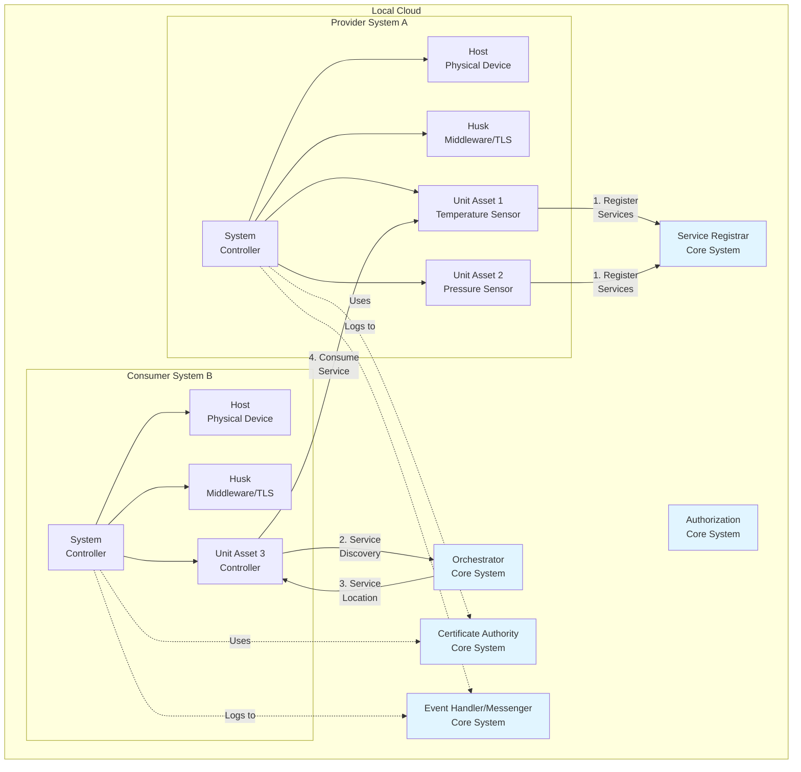
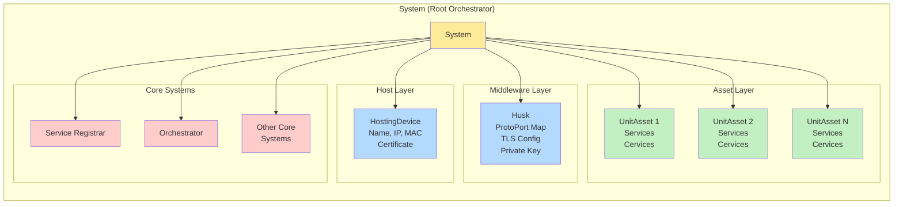
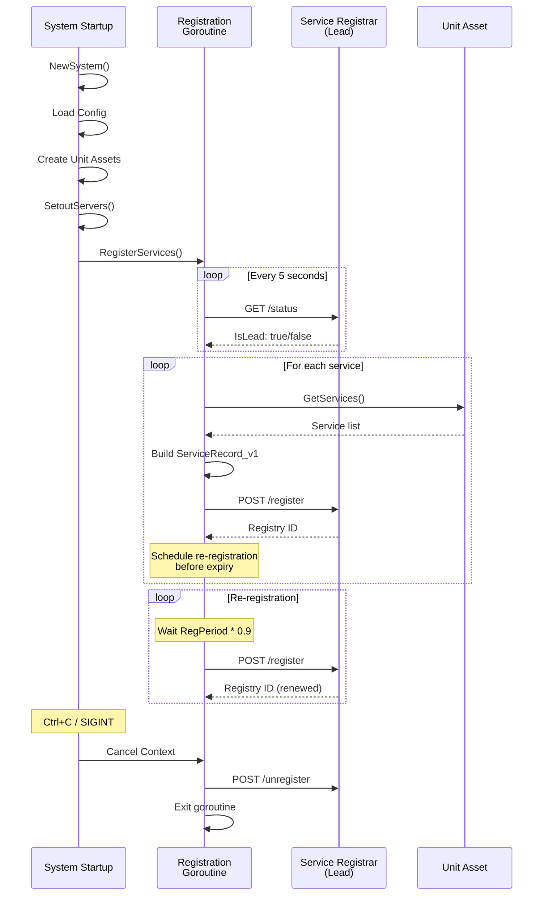
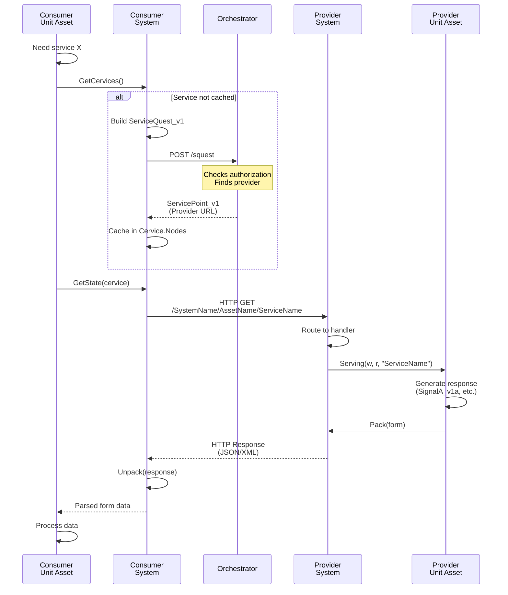
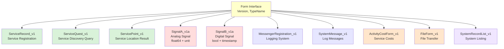

# mbaigo

**Base library for building Arrowhead-compliant distributed systems in Go**

The mbaigo project empowers technicians to deploy a system of systems within half a day and engineers to develop new applications within one day. It provides a robust foundation for building service-oriented cyber-physical systems (CPS) and IoT applications using the Arrowhead Framework.

## Status

- The code implementation is in its early stages and not production ready.
- The source code of the security systems will become available when they are ready.

## Table of Contents

- [Overview](#overview)
- [Architecture](#architecture)
- [Project Structure](#project-structure)
- [Module Organization](#module-organization)
- [Key Concepts](#key-concepts)
- [Getting Started](#getting-started)
  - [CLI Quick Start](#quick-start-with-cli)
  - [Library Usage](#basic-example)
- [CLI Reference](#cli-reference)
- [Configuration](#configuration)
- [Usage Examples](#usage-examples)
- [Development](#development)

## Overview

mbaigo is a Go module that implements the **Arrowhead Framework** - a service-oriented architecture (SOA) designed for distributed systems of systems. It provides:

- **Service Registration**: Automatic registration of services with core infrastructure
- **Service Discovery**: Dynamic lookup of service providers via orchestration
- **Secure Communication**: Mutual TLS authentication with X.509 certificates
- **Flexible Architecture**: Interface-based design for easy extension
- **Configuration Management**: JSON-based system configuration
- **Knowledge Graphs**: RDF/Turtle semantic models for system introspection

### Key Features

- ECDSA P256 elliptic curve cryptography for security
- HTTP/HTTPS REST APIs with configurable protocols and ports
- Periodic service re-registration with graceful shutdown
- Support for multiple data formats (JSON, XML)
- Versioned form schemas for backward compatibility
- Integrated logging and monitoring via messaging system
- HATEOAS-based HTML documentation generation

## Architecture

### High-Level System Architecture



### Component Hierarchy



### Service Registration Flow



### Service Discovery and Consumption Flow



### Data Exchange Forms



## Project Structure

This project follows the [Go Standard Project Layout](https://github.com/golang-standards/project-layout):

```
mbaigo/
├── cmd/                    # Command-line applications
│   └── mbaigo/             # mbaigo CLI tool
├── pkg/                    # Public library code
│   ├── components/         # System structure models
│   ├── forms/              # Data exchange schemas
│   └── usecases/           # Business logic
├── internal/               # Private application code
│   └── cli/                # CLI command implementations
├── examples/               # Example applications
│   ├── simple/             # Basic example
│   └── consumer-provider/  # Service interaction example
├── docs/                   # Documentation
│   ├── getting-started.md  # Tutorial guide
│   ├── cli-reference.md    # CLI documentation
│   ├── architecture.md     # Architecture overview
│   └── usecases.md         # Use cases documentation
├── scripts/                # Build and development scripts
│   ├── test.sh
│   ├── lint.sh
│   ├── coverage-report.sh
│   └── install-tools.sh
├── tests/                  # Integration tests
├── .github/workflows/      # CI/CD pipelines
├── go.mod                  # Go module definition
├── Makefile                # Build automation
├── LICENSE
└── README.md
```

## Module Organization

The mbaigo module consists of three public packages under `/pkg`:

### 1. Components Package (`/pkg/components`)

Models the structure of all systems using hierarchical composition:

- **`system.go`**: Root orchestrator containing Host, Husk, and UnitAssets
- **`host.go`**: HostingDevice representing the physical/virtual machine
- **`husk.go`**: Middleware layer handling TLS, protocols, and security
- **`service.go`**: Service (provided) and Cervice (consumed) definitions
- **`uasset.go`**: UnitAsset interface for domain-specific implementations

```go
type UnitAsset interface {
    GetName() string
    GetServices() Services      // What this asset provides
    GetCervices() Cervices      // What this asset consumes
    GetDetails() map[string][]string
    GetTraits() any             // Domain-specific configuration
    Serving(w http.ResponseWriter, r *http.Request, servicePath string)
}
```

### 2. Forms Package (`/pkg/forms`)

Describes the content of information exchange with versioned schemas:

- **`forms_definition.go`**: Form interface and type registry (FormTypeMap)
- **`service_forms.go`**: ServiceRecord_v1, ServiceRecordList_v1
- **`servicequest_forms.go`**: ServiceQuest_v1, ServicePoint_v1
- **`signal_forms.go`**: SignalA_v1a (analog), SignalB_v1a (digital)
- **`message_forms.go`**: System messaging and logging
- **`cost_forms.go`**: Service activity cost tracking
- **`certificate_forms.go`**: Certificate management

All forms support JSON and XML serialization with backward compatibility through versioning.

### 3. Use Cases Package (`/pkg/usecases`)

Models common behaviors and business logic:

- **`registration.go`**: Service registration and periodic re-registration
- **`service_discovery.go`**: Query Orchestrator for service locations
- **`consumption.go`**: Make requests to provider services
- **`provision.go`**: HTTP handlers for serving requests
- **`configuration.go`**: Load/save `systemconfig.json`
- **`authentication.go`**: Generate keys and certificate signing requests
- **`servers_handlers.go`**: Setup HTTP/HTTPS servers with mutual TLS
- **`cost.go`**: Service activity cost management
- **`docs.go`**: Generate HATEOAS HTML documentation
- **`kgraphing.go`**: Generate RDF/Turtle knowledge graphs
- **`utilities.go`**: Pack/Unpack forms, signature validation

## Key Concepts

### System

The root orchestrator that aggregates:
- A Host (physical device)
- A Husk (middleware/security layer)
- Multiple UnitAssets (domain-specific components)
- References to CoreSystems (infrastructure)
- Runtime context for graceful shutdown

### Host (HostingDevice)

Represents the physical or virtual machine running the system:
- Hostname and ID
- IP addresses (all network interfaces)
- MAC addresses
- X.509 certificate
- Metadata

### Husk

The middleware/wrapper layer providing:
- Protocol-to-port bindings (http:8080, https:8443)
- TLS configuration for mutual authentication
- Private key (ECDSA P256)
- CA certificate for verification
- Documentation links

### UnitAsset

Domain-specific components implementing the UnitAsset interface:
- **Services**: REST endpoints the asset provides to others
- **Cervices**: Services the asset consumes from others
- **Traits**: Custom configuration specific to the asset type
- **Serving()**: HTTP handler for incoming service requests

### Service vs Cervice

- **Service**: What a UnitAsset **provides** (e.g., "TemperatureReading")
- **Cervice**: What a UnitAsset **consumes** (e.g., needs a "TimeSync" service)

### Core Systems

Mandatory infrastructure in an Arrowhead Local Cloud:
- **Service Registrar**: Registry of all available services
- **Orchestrator**: Service discovery and routing
- **Authorization**: Access control (in development)
- **Certificate Authority**: Issues signed certificates
- **Event Handler/Messenger**: Logging and monitoring

## Getting Started

### Prerequisites

- Go 1.24.4 or later
- Access to an Arrowhead Local Cloud (Core Systems)
- X.509 certificates (or ability to request them from CA)

### Installation

#### Install the CLI

```bash
# Install the mbaigo CLI tool
go install github.com/sdoque/mbaigo/cmd/mbaigo@latest

# Verify installation
mbaigo version
```

#### Use as a Library

```bash
go get github.com/sdoque/mbaigo
```

### Quick Start with CLI

The fastest way to get started is using the `mbaigo` CLI:

```bash
# 1. Initialize a new system
mbaigo init --name MySystem --cloud LocalCloud

# 2. Generate an example application
mbaigo generate example > main.go

# 3. Run your system
go mod init my-system
go mod tidy
go run main.go
```

Your system is now running! Try:
```bash
curl http://localhost:8080/MySystem/example/random
```

See the [Getting Started Guide](./docs/getting-started.md) for a complete tutorial.

### Basic Example

```go
package main

import (
    "context"
    "fmt"
    "os"
    "os/signal"
    "syscall"

    "github.com/sdoque/mbaigo/pkg/components"
    "github.com/sdoque/mbaigo/pkg/usecases"
)

func main() {
    // Create context for graceful shutdown
    ctx, cancel := context.WithCancel(context.Background())
    defer cancel()

    // Create a new system
    sys := components.NewSystem("MySystem", ctx)

    // Load or create configuration
    usecases.Configure(&sys)

    // Request certificate from CA (if needed)
    usecases.RequestCertificate(&sys)

    // Setup and start HTTP/HTTPS servers
    go usecases.SetoutServers(&sys)

    // Register services with Service Registrar
    go usecases.RegisterServices(&sys)

    // Wait for shutdown signal
    sigChan := make(chan os.Signal, 1)
    signal.Notify(sigChan, os.Interrupt, syscall.SIGTERM)
    <-sigChan

    fmt.Println("Shutting down gracefully...")
    cancel()
}
```

### Implementing a Custom UnitAsset

```go
package main

import (
    "encoding/json"
    "net/http"
    "time"

    "github.com/sdoque/mbaigo/pkg/components"
    "github.com/sdoque/mbaigo/pkg/forms"
    "github.com/sdoque/mbaigo/pkg/usecases"
)

// TemperatureSensor implements the UnitAsset interface
type TemperatureSensor struct {
    Name     string
    Services components.Services
    Cervices components.Cervices
    Details  map[string][]string
    Traits   SensorTraits

    // Domain-specific fields
    currentTemp float64
}

type SensorTraits struct {
    MinValue float64 `json:"minValue"`
    MaxValue float64 `json:"maxValue"`
    Unit     string  `json:"unit"`
}

func (ts *TemperatureSensor) GetName() string {
    return ts.Name
}

func (ts *TemperatureSensor) GetServices() components.Services {
    return ts.Services
}

func (ts *TemperatureSensor) GetCervices() components.Cervices {
    return ts.Cervices
}

func (ts *TemperatureSensor) GetDetails() map[string][]string {
    return ts.Details
}

func (ts *TemperatureSensor) GetTraits() any {
    return ts.Traits
}

func (ts *TemperatureSensor) Serving(w http.ResponseWriter, r *http.Request, servicePath string) {
    switch servicePath {
    case "temperature":
        // Create analog signal form
        signal := forms.SignalA_v1a{
            Value:     ts.currentTemp,
            Unit:      ts.Traits.Unit,
            Timestamp: time.Now().Unix(),
        }

        // Pack and send response
        packed, err := usecases.Pack(signal)
        if err != nil {
            http.Error(w, "Failed to pack response", http.StatusInternalServerError)
            return
        }

        w.Header().Set("Content-Type", "application/json")
        w.Write(packed)

    default:
        http.Error(w, "Unknown service path", http.StatusNotFound)
    }
}

// Factory function to create asset from configuration
func NewTemperatureSensor(config usecases.ConfigurableAsset) components.UnitAsset {
    var traits SensorTraits
    if len(config.Traits) > 0 {
        json.Unmarshal(config.Traits[0], &traits)
    }

    return &TemperatureSensor{
        Name:     config.Name,
        Services: config.Services,
        Details:  config.Details,
        Traits:   traits,
        currentTemp: 22.5, // Initial value
    }
}
```

## Configuration

### systemconfig.json

The system configuration file is automatically created if it doesn't exist. Example:

```json
{
  "systemname": "TemperatureMonitor",
  "localcloud": "SmartBuilding",
  "protocolsNports": {
    "http": 8080,
    "https": 8443
  },
  "coreSystems": [
    {
      "coreSystem": "serviceregistrar",
      "url": "https://localhost:8000"
    },
    {
      "coreSystem": "orchestrator",
      "url": "https://localhost:8001"
    }
  ],
  "unit_assets": [
    {
      "name": "TempSensor1",
      "details": {
        "location": ["room101"],
        "type": ["PT100"]
      },
      "services": [
        {
          "definition": "TemperatureReading",
          "subpath": "temperature",
          "registrationPeriod": 60,
          "details": {
            "datatype": ["float64"],
            "unit": ["celsius"]
          },
          "description": "Provides current temperature reading",
          "costUnit": "credits"
        }
      ],
      "traits": [
        {
          "minValue": -50,
          "maxValue": 150,
          "unit": "celsius"
        }
      ]
    }
  ]
}
```

### Configuration Fields

- **systemname**: Unique identifier for this system in the local cloud
- **localcloud**: Name of the Arrowhead Local Cloud
- **protocolsNports**: Protocol-to-port mappings
- **coreSystems**: URLs of core infrastructure systems
- **unit_assets**: Array of asset definitions with:
  - **name**: Asset identifier
  - **details**: Metadata key-value pairs
  - **services**: Array of provided service definitions
  - **traits**: Asset-specific configuration (custom JSON)

## Usage Examples

### Service Discovery

```go
// Create a service quest
questForm := forms.ServiceQuest_v1{
    RequesterSystem: sys.Name,
    RequesterIP:     sys.Host.IPAddresses[0],
    ServiceDefinition: "TemperatureReading",
    ProtocolPreference: []string{"https", "http"},
}

// Search for service
servicePoint, err := usecases.Search4Service(questForm, &sys)
if err != nil {
    log.Printf("Service discovery failed: %v", err)
    return
}

fmt.Printf("Found service at: %s\n", servicePoint.ServiceURL)
```

### Consuming a Service

```go
// Define the cervice (consumed service)
cervice := components.Cervice{
    Definition: "TemperatureReading",
    Details:    map[string][]string{"location": {"room101"}},
    Protos:     []string{"https"},
}

// Get state from provider
response, err := usecases.GetState(cervice, &sys)
if err != nil {
    log.Printf("Failed to get state: %v", err)
    return
}

// Unpack the response
var signal forms.SignalA_v1a
err = usecases.Unpack(response, &signal)
if err != nil {
    log.Printf("Failed to unpack response: %v", err)
    return
}

fmt.Printf("Temperature: %.2f %s\n", signal.Value, signal.Unit)
```

### Registering Unit Assets

```go
// Register factory function for your custom asset type
usecases.RegisterAssetFactory("TemperatureSensor", NewTemperatureSensor)

// Load assets from configuration
assets := usecases.LoadUnitAssets("systemconfig.json")

// Add assets to system
for _, asset := range assets {
    sys.UAssets[asset.GetName()] = &asset
}
```

## CLI Reference

The mbaigo CLI provides commands for rapid development and management of Arrowhead systems.

### Available Commands

| Command | Description |
|---------|-------------|
| `mbaigo init` | Initialize a new system configuration |
| `mbaigo config show` | Display current configuration |
| `mbaigo config validate` | Validate configuration file |
| `mbaigo system info` | Show system information |
| `mbaigo system start` | Generate starter main.go template |
| `mbaigo service list` | List all configured services |
| `mbaigo service add` | Add a service to an asset |
| `mbaigo cert generate-key` | Generate ECDSA private key |
| `mbaigo cert create-csr` | Create certificate signing request |
| `mbaigo generate asset` | Generate unit asset template |
| `mbaigo generate example` | Generate complete example app |
| `mbaigo version` | Show version information |

### Examples

```bash
# Initialize new system
mbaigo init --name TemperatureMonitor --cloud Building1

# Generate asset code
mbaigo generate asset --name TemperatureSensor

# Add service
mbaigo service add --asset TempSensor --name Temperature

# List all services
mbaigo service list

# Generate certificates
mbaigo cert generate-key
mbaigo cert create-csr

# JSON output for scripting
mbaigo system info --json
```

For complete CLI documentation, see [CLI Reference](./docs/cli-reference.md).

## Development

### Package Structure

```
pkg/
├── components/          # System structure models
│   ├── system.go
│   ├── host.go
│   ├── husk.go
│   ├── service.go
│   └── uasset.go
├── forms/              # Data exchange schemas
│   ├── forms_definition.go
│   ├── service_forms.go
│   ├── servicequest_forms.go
│   ├── signal_forms.go
│   ├── message_forms.go
│   ├── cost_forms.go
│   └── certificate_forms.go
└── usecases/           # Business logic
    ├── registration.go
    ├── service_discovery.go
    ├── consumption.go
    ├── provision.go
    ├── configuration.go
    ├── authentication.go
    ├── servers_handlers.go
    ├── cost.go
    ├── docs.go
    ├── kgraphing.go
    └── utilities.go
```

### Building

```bash
# Download dependencies
go mod download

# Build the module
go build ./...

# Build the CLI (outputs to ./bin/mbaigo)
go build -o bin/mbaigo ./cmd/mbaigo

# Or use Make
make deps      # Download dependencies
make build     # Build everything (outputs to ./bin/)
```

### Running Tests

```bash
# Run tests
go test ./...

# With coverage
go test -coverprofile=coverage.out ./...
go tool cover -html=coverage.out

# Or use Make/scripts
make test      # Run tests with race detection
make analyse   # Generate detailed coverage report
```

### Code Quality (Optional Tools)

```bash
# Install optional development tools
make tools

# Run linters
make lint           # All linters
make spellcheck     # Spell checker
make runchecks      # Everything

# Or manually
go fmt ./...
go vet ./...
staticcheck ./...
gosec ./...
```

### Dependency Management

```bash
# Add a dependency
go get github.com/some/package

# Update dependencies
go get -u ./...
go mod tidy

# Verify dependencies
go mod verify

# Vendor (optional)
make vendor
```

### Testing Checklist

- Unit tests for all components and forms
- Integration tests for service registration flow
- Integration tests for service discovery flow
- Integration tests for service consumption
- TLS/mTLS authentication tests
- Configuration loading/saving tests
- Error handling and edge cases

## Contributing

This project is in early development. Please ensure:

1. Dependencies are properly declared in `go.mod`
2. All code is formatted with `go fmt`
3. All tests pass (`make test` or `go test ./...`)
4. Code passes static analysis (`make lint`)
5. Documentation is updated for new features

```bash
# Before submitting
go mod tidy          # Clean up dependencies
make runchecks       # Run all checks
```

## License

[To be determined]

## References

- [Arrowhead Framework Documentation](https://arrowhead.eu/)
- [Arrowhead Framework GitHub](https://github.com/eclipse-arrowhead)
- Go standard library: `net/http`, `crypto`, `encoding/json`, `context`

## Support

For issues and questions:
- Check the `/tests/examples_test.go` for working examples
- Review the generated HATEOAS documentation (available at runtime)
- Examine RDF/Turtle knowledge graphs for system topology

---

**Made with mbaigo** - Empowering rapid development of distributed cyber-physical systems
