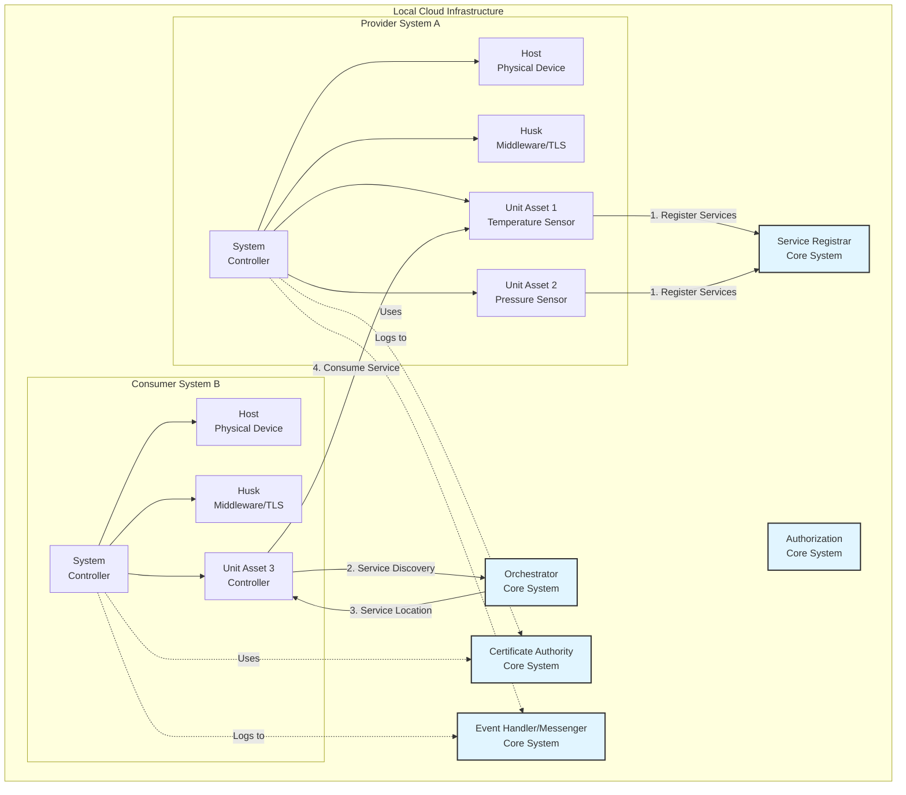
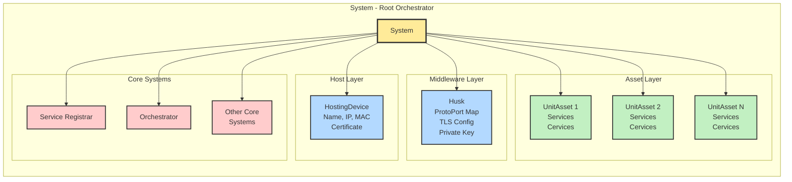
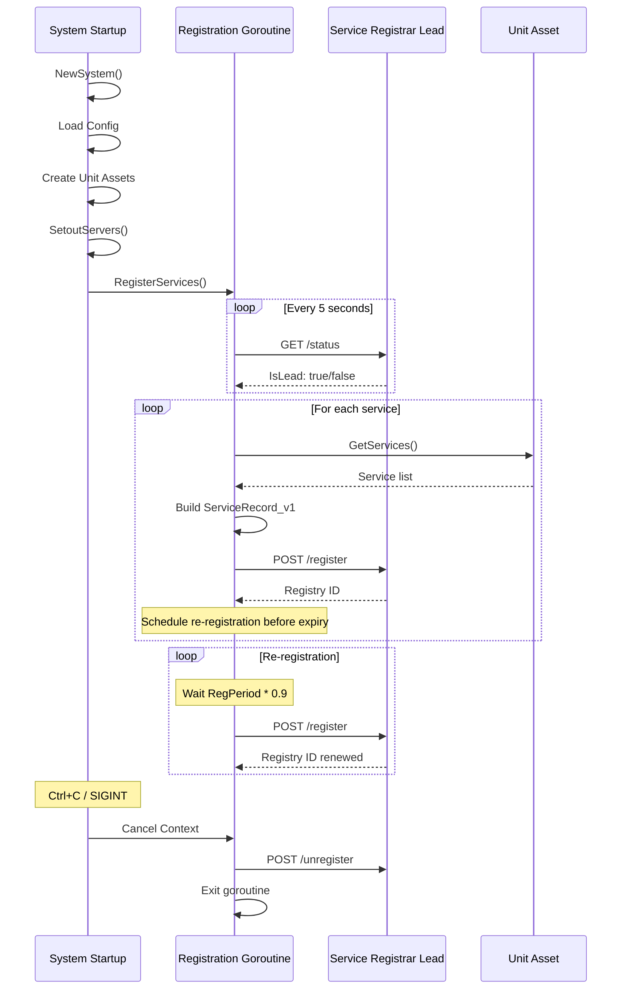
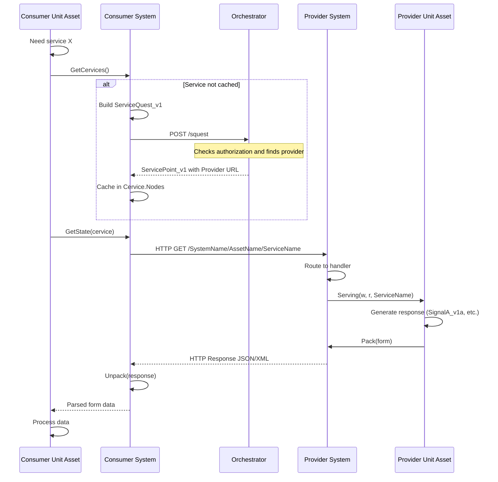

# mbaigo Architecture

This document describes the architectural design and principles of mbaigo, including detailed diagrams of system structure, service flows, and data exchange patterns.

## Overview

mbaigo implements the **Arrowhead Framework** - a service-oriented architecture (SOA) for building distributed systems of systems. It's specifically designed for cyber-physical systems (CPS) and IoT applications.

## High-Level System Architecture



## Component Hierarchy



## Service Registration Flow



## Service Discovery and Consumption Flow



## Data Exchange Forms

```mermaid
graph TD
    F["Form Interface
    Version, TypeName"]

    F --> SR["ServiceRecord_v1
    Service Registration"]
    F --> SQ["ServiceQuest_v1
    Service Discovery Query"]
    F --> SP["ServicePoint_v1
    Service Location Result"]
    F --> SA["SignalA_v1a
    Analog Signal
    float64 + unit"]
    F --> SB["SignalB_v1a
    Digital Signal
    bool + timestamp"]
    F --> MR["MessengerRegistration_v1
    Logging System"]
    F --> SM["SystemMessage_v1
    Log Messages"]
    F --> AC["ActivityCostForm_v1
    Service Costs"]
    F --> FF["FileForm_v1
    File Transfer"]
    F --> SRL["SystemRecordList_v1
    System Listing"]

    style F fill:#ffffcc,stroke:#333,stroke-width:3px
    style SR fill:#d9f2d9,stroke:#333,stroke-width:2px
    style SQ fill:#d9f2d9,stroke:#333,stroke-width:2px
    style SP fill:#d9f2d9,stroke:#333,stroke-width:2px
    style SA fill:#ffdddd,stroke:#333,stroke-width:2px
    style SB fill:#ffdddd,stroke:#333,stroke-width:2px
    style MR fill:#e6e6ff,stroke:#333,stroke-width:2px
    style SM fill:#e6e6ff,stroke:#333,stroke-width:2px
    style AC fill:#ffe6cc,stroke:#333,stroke-width:2px
    style FF fill:#ffe6cc,stroke:#333,stroke-width:2px
    style SRL fill:#f0e6ff,stroke:#333,stroke-width:2px
```



## Core Architecture Principles

### 1. Hierarchical Composition

Systems are composed hierarchically:

```
System (root orchestrator)
├── Host (physical/virtual machine)
├── Husk (middleware/security layer)
└── UnitAssets (domain-specific components)
    ├── Services (what they provide)
    └── Cervices (what they consume)
```

### 2. Interface-Based Design

The `UnitAsset` interface allows any domain-specific component to participate in the Arrowhead ecosystem:

```go
type UnitAsset interface {
    GetName() string
    GetServices() Services
    GetCervices() Cervices
    GetDetails() map[string][]string
    GetTraits() any
    Serving(w http.ResponseWriter, r *http.Request, servicePath string)
}
```

### 3. Service-Oriented Communication

All interaction happens through services:
- **Services**: REST endpoints a UnitAsset provides
- **Cervices**: Services a UnitAsset consumes from others
- **Forms**: Versioned data structures for exchange

### 4. Core Systems Pattern

Mandatory infrastructure (Local Cloud):
- **Service Registrar**: Service registry
- **Orchestrator**: Service discovery and routing
- **Authorization**: Access control
- **Certificate Authority**: Certificate management
- **Event Handler**: Logging and monitoring

## Package Organization

### `/pkg/components`
Structural building blocks:
- `System`: Root orchestrator
- `HostingDevice`: Physical/virtual machine abstraction
- `Husk`: Middleware layer (TLS, protocols, ports)
- `Service` & `Cervice`: Service definitions
- `UnitAsset`: Interface for domain implementations

### `/pkg/forms`
Data exchange schemas:
- Form interface with versioning support
- Service forms (registration, discovery)
- Signal forms (analog, digital data)
- System forms (configuration, messages)
- Cost and certificate forms

Versioning scheme: `TypeName_v1`, `TypeName_v2`, etc.

### `/pkg/usecases`
Business logic and behaviors:
- **Registration**: Service lifecycle management
- **Service Discovery**: Orchestrator interaction
- **Consumption**: Making requests to providers
- **Provision**: Handling incoming requests
- **Configuration**: System setup and persistence
- **Authentication**: Key and certificate management
- **Servers & Handlers**: HTTP/HTTPS setup
- **Documentation**: HATEOAS HTML generation
- **Knowledge Graphs**: RDF/Turtle generation

## Key Architectural Patterns

### 1. Registration Loop

Each service runs in its own goroutine with periodic re-registration:

```
Start → Find Lead Registrar → Register Service → Wait 90% of Period → Re-register
                                                                               ↑
                                                                               |
                                                                          ─────┘
```

### 2. Service Discovery with Caching

```
Need Service → Check Cache → (miss) → Query Orchestrator → Cache Result → Use Service
                           → (hit) → Use Service
```

### 3. Graceful Shutdown

Uses `context.Context` for coordinated shutdown:
- Cancel context on SIGINT/SIGTERM
- All goroutines watch context
- Unregister services before exit
- Clean up resources

### 4. Mutual TLS

Security through certificate-based authentication:
- ECDSA P256 key generation
- X.509 certificates from CA
- Client and server verification
- TLS 1.2+ enforcement

## Data Flow

### Service Request Flow

```
Consumer → GetState() → (Discovery if needed) → HTTP Request → Provider
                                                                    ↓
Consumer ← Unpack() ← HTTP Response ← Pack() ← Serving() ← Provider
```

### Form Serialization

```
Go Struct → NewForm() → Pack() → JSON/XML bytes → HTTP
                                                     ↓
Go Struct ← Unpack() ← Parse JSON/XML ← HTTP Response
```

## Concurrency Model

- Main thread: HTTP server (blocking)
- Registration goroutines: One per service
- Registrar finder: Shared goroutine
- Context-based cancellation: Clean shutdown

## Configuration Management

### systemconfig.json Structure

```json
{
  "systemname": "...",
  "localcloud": "...",
  "protocolsNports": { "http": 8080, "https": 8443 },
  "coreSystems": [...],
  "unit_assets": [...]
}
```

### Loading Process

1. Check if config exists
2. If not, create from system state
3. Load core system URLs
4. Instantiate unit assets with traits
5. Register asset factory functions

## Extension Points

### 1. Custom UnitAssets

Implement the `UnitAsset` interface with domain-specific logic.

### 2. Custom Forms

Create new form types implementing the `Form` interface with versioning.

### 3. Custom Traits

Asset-specific configuration via the `Traits` field (any JSON structure).

### 4. Asset Factories

Register factory functions to instantiate assets from configuration:

```go
usecases.RegisterAssetFactory("MyAsset", NewMyAsset)
```

## Security Considerations

- Mutual TLS for all HTTPS communication
- Certificate-based authentication
- Private keys stored securely
- No credentials in configuration files
- Service authorization via Authorization system

## Performance Characteristics

- Non-blocking service registration
- Cached service discovery results
- Goroutine-per-service for registration
- Connection pooling for HTTP clients
- Minimal memory footprint per asset

## Limitations and Future Work

- Authorization system in development
- Event subscription not yet implemented
- No built-in service versioning (use details field)
- Single Local Cloud per system
- No cross-cloud orchestration yet

## Further Reading

- [Arrowhead Framework Documentation](https://arrowhead.eu/)
- [Arrowhead Framework GitHub](https://github.com/eclipse-arrowhead)
- [Getting Started Guide](./GETTING-STARTED.md)
- [CLI Reference](./CLI-REFERENCE.md)
- [Use Cases](./USECASES.md)
