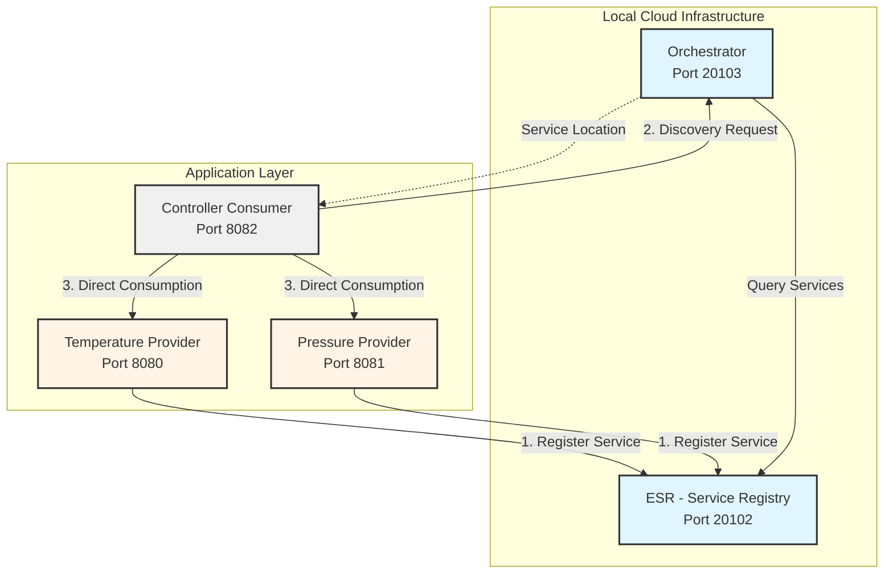
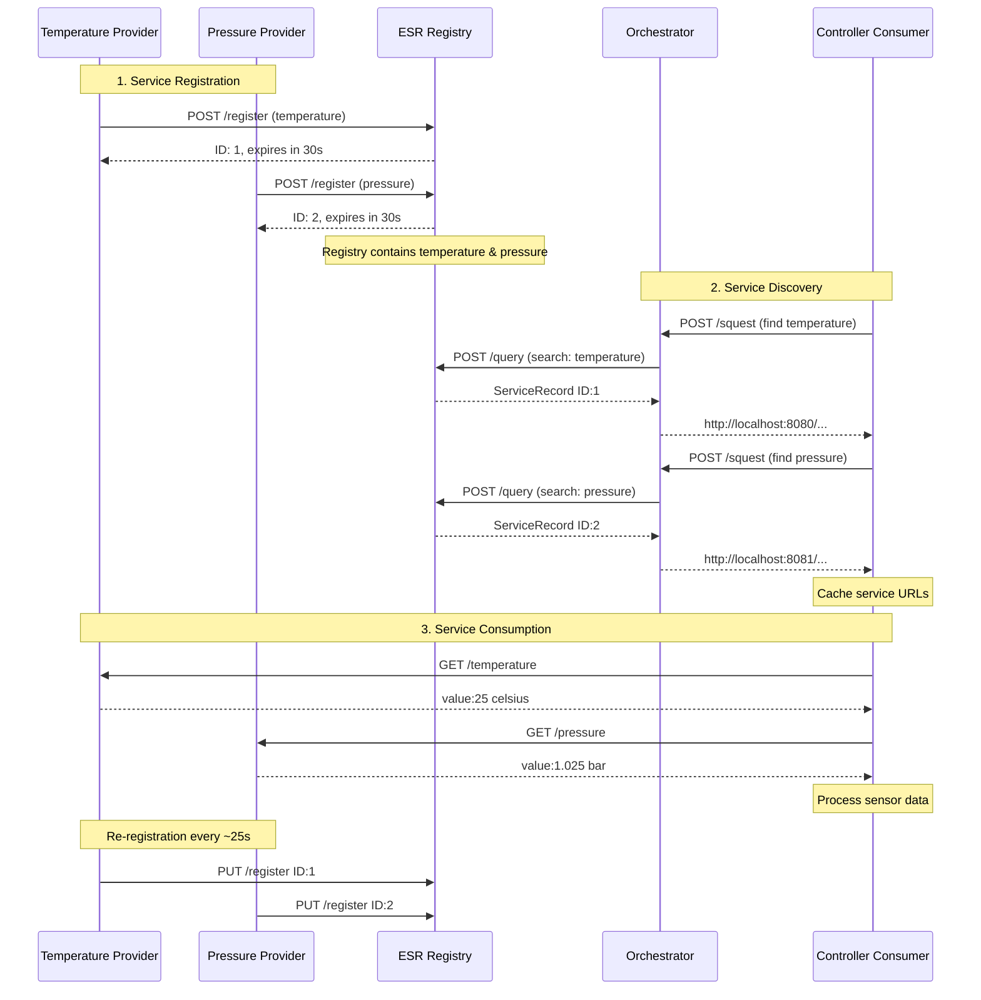
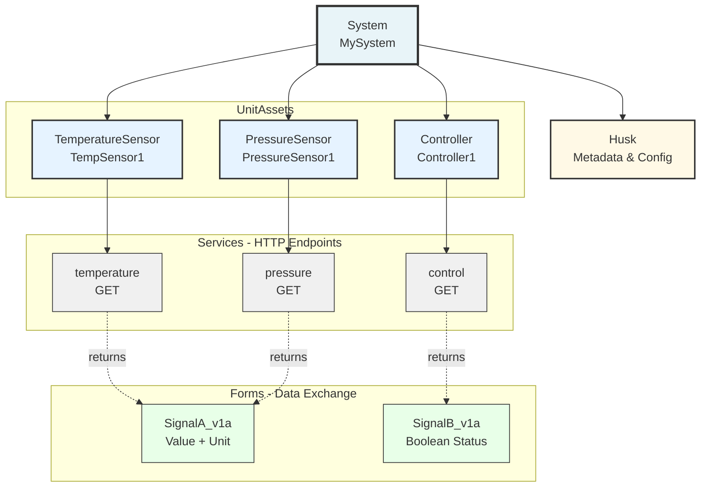

# Three Sensors Example

This example demonstrates a complete mbaigo system with three different asset types:

- **Temperature Sensor** - Simulated analog sensor reading temperature in Celsius
- **Pressure Sensor** - Simulated analog sensor reading pressure in bar
- **Controller** - Digital controller providing boolean status

## Quick Start

### Single Process (All Assets Together)

Run all three assets in one process:

```bash
cd examples/three-sensors
go run *.go
```

**Expected Output:**

```
🚀 System Started!
=============================================================
System Name:  MySystem
Local Cloud:  LocalCloud
HTTP:         http://localhost:8080

📍 Available Endpoints:
  GET /MySystem/TempSensor1/temperature
  GET /MySystem/PressureSensor1/pressure
  GET /MySystem/Controller1/control
=============================================================

💡 Test with:
  curl http://localhost:8080/MySystem/TempSensor1/temperature
  curl http://localhost:8080/MySystem/PressureSensor1/pressure
  curl http://localhost:8080/MySystem/Controller1/control

Press Ctrl+C to stop...
```

**Test the services:**

```bash
# Temperature sensor
curl http://localhost:8080/MySystem/TempSensor1/temperature
# Response: {"value":25,"unit":"celsius","timestamp":"2025-11-11T23:35:58+01:00","version":"SignalA_v1.0"}

# Pressure sensor
curl http://localhost:8080/MySystem/PressureSensor1/pressure
# Response: {"value":1.025,"unit":"bar","timestamp":"2025-11-11T23:36:02+01:00","version":"SignalA_v1.0"}

# Controller
curl http://localhost:8080/MySystem/Controller1/control
# Response: {"value":true,"timestamp":"2025-11-11T23:36:02+01:00","version":"SignalB_v1.0"}
```

---

## Multi-Process Setup (Service-Oriented Architecture)

Run a complete Arrowhead Framework with **5 separate processes** demonstrating service registration, discovery, and consumption.

### Architecture Overview



### Prerequisites

- Go 1.24.4 or later
- Clone this repository and be in the root directory
- Build the mbaigo CLI: `make build`

### Step 1: Start Core Systems

The mbaigo CLI includes **embedded core systems** (ESR and Orchestrator) for instant startup.

**Terminal 1 - Start ESR (Service Registry):**

```bash
# From mbaigo root directory
./bin/mbaigo core start esr
```

- **Starts immediately** (no compilation needed!)
- First run: Creates `systemconfig.json` in `systems/esr/` and exits
- Run again: Starts on port 20102
- Tracks all registered services

**Verify it's running:**
```bash
curl http://localhost:20102/serviceregistrar/registry/status
# Should return: "lead Service Registrar since..."
```

**Terminal 2 - Start Orchestrator:**

```bash
# From mbaigo root directory
./bin/mbaigo core start orchestrator
```

- **Starts immediately** (embedded!)
- First run: Creates config and exits
- Run again: Starts on port 20103
- Handles service discovery

### Step 2: Start Application Systems

Now start the three application systems that will register and discover each other.

**Terminal 3 - Temperature Provider:**

```bash
cd examples/three-sensors
go run main.go temperaturesensor_asset.go
```

- Starts HTTP server on port 8080
- Registers temperature service with ESR
- Provides temperature readings

**Terminal 4 - Pressure Provider:**

```bash
cd examples/three-sensors
go run main.go pressuresensor_asset.go
```

**Note:** You'll need to modify the system to use port 8081 to avoid conflicts.

**Terminal 5 - Controller (Consumer):**

```bash
cd examples/three-sensors
go run main.go controller_asset.go
```

- Queries orchestrator for temperature service
- Queries orchestrator for pressure service
- Consumes data from both providers

### Verify the Setup

**Check Service Registry:**

Open in browser: `http://localhost:20102/serviceregistrar/registry/query`

You should see all registered services with:
- Service ID, definition, system name
- IP addresses and ports
- Expiration times

**Test Individual Services:**

```bash
# Temperature
curl http://localhost:8080/MySystem/TemperatureSensor1/temperature

# Pressure
curl http://localhost:8081/MySystem/PressureSensor1/pressure
```

### Service Flow



**Flow Details:**

1. **Registration:**
   - Providers register services with ESR
   - Re-registration happens every ~25 seconds

2. **Discovery:**
   - Controller asks Orchestrator for services
   - Orchestrator queries ESR and returns provider URLs
   - Controller caches service locations

3. **Consumption:**
   - Controller makes HTTP GET requests to providers
   - Providers return sensor data
   - Controller processes the data

### Stopping All Processes

Press `Ctrl+C` in each terminal (reverse order recommended):
1. Controller (Terminal 5)
2. Pressure Provider (Terminal 4)
3. Temperature Provider (Terminal 3)
4. Orchestrator (Terminal 2)
5. ESR (Terminal 1)

Systems gracefully shutdown:
- Unregister services from ESR
- Close HTTP servers
- Clean up resources

### Common Issues

**Port Already in Use:**
```bash
# Find and kill process using port 8080
lsof -ti:8080 | xargs kill -9
```

**ESR Not Found:**
- Ensure ESR is running on port 20102
- Check `systemconfig.json` has correct ESR URL:
  ```json
  {
    "coreSystems": [{
      "coreSystem": "serviceregistrar",
      "url": "http://localhost:20102/serviceregistrar/registry"
    }]
  }
  ```

**Service Not Found:**
- Verify provider is running and registered
- Check ESR: `curl http://localhost:20102/serviceregistrar/registry/query`
- Ensure service names match exactly

---

## Files

- **main.go** - Application entry point
  - Creates the system
  - Registers asset factories
  - Loads configuration
  - Starts HTTP server

- **temperaturesensor_asset.go** - Temperature sensor
  - Configurable min/max range via Traits
  - Simulated readings with variation
  - Returns SignalA_v1a form

- **pressuresensor_asset.go** - Pressure sensor
  - Configurable min/max range via Traits
  - Simulated readings with variation
  - Returns SignalA_v1a form

- **controller_asset.go** - Controller
  - Returns boolean status (active/inactive)
  - Returns SignalB_v1a form

- **systemconfig.json** - System configuration (auto-generated)
  - Defines three assets with their services
  - Configures traits (min/max values)
  - Sets HTTP port and core system URLs

## Key Concepts

### 1. Asset Factory Pattern

```go
// Register factories for dynamic asset creation
usecases.RegisterAssetFactory("TemperatureSensor", NewTemperatureSensor)
usecases.RegisterAssetFactory("PressureSensor", NewPressureSensor)
usecases.RegisterAssetFactory("Controller", NewController)
```

Assets are instantiated at runtime based on configuration.

### 2. Configuration-Driven Assets

The `systemconfig.json` file defines assets:

```json
{
  "name": "TempSensor1",
  "details": {
    "type": ["TemperatureSensor"]
  },
  "traits": [
    {
      "minValue": 0,
      "maxValue": 50
    }
  ]
}
```

### 3. Service Implementation

Each asset implements the `Serving()` method:

```go
func (a *TemperatureSensor) Serving(w http.ResponseWriter, r *http.Request, servicePath string) {
    switch servicePath {
    case "temperature":
        signal := forms.SignalA_v1a{
            Value:     temp,
            Unit:      "celsius",
            Timestamp: time.Now(),
        }
        packed, _ := usecases.Pack(signal.NewForm(), "application/json")
        w.Header().Set("Content-Type", "application/json")
        w.Write(packed)
    }
}
```

### 4. Traits for Asset Configuration

Traits allow runtime configuration:

```go
type TemperatureSensorTraits struct {
    MinValue float64 `json:"minValue"`
    MaxValue float64 `json:"maxValue"`
}
```

## Customization Ideas

### Replace Simulation with Real Sensors

**DS18B20 Temperature Sensor:**

```go
import "github.com/yryz/ds18b20"

func (a *TemperatureSensor) Serving(w http.ResponseWriter, r *http.Request, servicePath string) {
    sensors, _ := ds18b20.Sensors()
    temp, _ := ds18b20.Temperature(sensors[0])

    signal := forms.SignalA_v1a{
        Value:     temp,
        Unit:      "celsius",
        Timestamp: time.Now(),
    }
    // ...
}
```

### Add State Management

```go
type Controller struct {
    state      string
    lastUpdate time.Time
}

func (a *Controller) Serving(w http.ResponseWriter, r *http.Request, servicePath string) {
    if r.Method == "POST" {
        var cmd ControlCommand
        json.NewDecoder(r.Body).Decode(&cmd)
        a.executeCommand(cmd)
    }
    // Return current state
}
```

### Add Error Handling

```go
func (a *PressureSensor) Serving(w http.ResponseWriter, r *http.Request, servicePath string) {
    pressure, err := a.readSensor()
    if err != nil {
        http.Error(w, "sensor read failed", http.StatusInternalServerError)
        return
    }
    // ... continue with valid reading
}
```

## Architecture Notes

This example follows the mbaigo architecture:



**Component Hierarchy:**

1. **System** - Container for all components
2. **Husk** - System metadata (ports, description, etc.)
3. **UnitAssets** - Individual devices/sensors/actuators
4. **Services** - HTTP endpoints exposed by assets
5. **Forms** - Standardized data exchange formats (SignalA_v1a, SignalB_v1a)

## CLI Reference

```bash
# List core systems (embedded ones marked [EMBEDDED])
./bin/mbaigo core list

# Start embedded core systems
./bin/mbaigo core start esr
./bin/mbaigo core start orchestrator

# Build and install CLI globally
make build
go install ./cmd/mbaigo

# Then use anywhere
mbaigo core list
mbaigo core start esr
```

**Benefits of embedded core systems:**
- ✅ Single binary deployment (10MB)
- ✅ No runtime compilation
- ✅ Instant startup
- ✅ No separate go.mod management
- ✅ Consistent versions

## Next Steps

1. **Modify simulations** - Change random value generation
2. **Add new services** - Extend assets with endpoints
3. **Create new assets** - Additional sensor types
4. **Integrate hardware** - Replace simulations with real I/O
5. **Add persistence** - Store readings in database
6. **Add MQTT** - Publish readings to broker
7. **Use HTTPS** - Enable mutual TLS authentication

### Create Separate Provider Applications

For true multi-process architecture, create dedicated applications:

```bash
examples/temperature-provider/
examples/pressure-provider/
examples/controller-consumer/
```

Each with:
- Own `main.go`
- Own `systemconfig.json`
- Unique system name
- Unique port

## Learn More

- [Main README](../../README.md) - Full mbaigo documentation
- [Getting Started Guide](../../GETTING-STARTED.md) - Tutorial guide
- [CLI Reference](../../docs/CLI-REFERENCE.MD) - Complete CLI docs
- [Architecture](../../docs/ARCHITECTURE.MD) - System architecture details
- [Examples](../README.md) - More example applications
